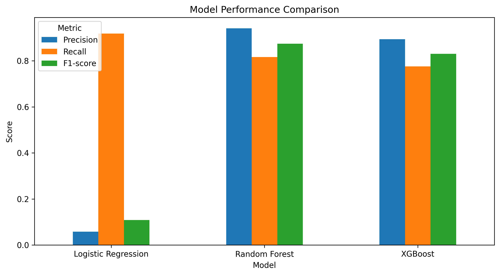
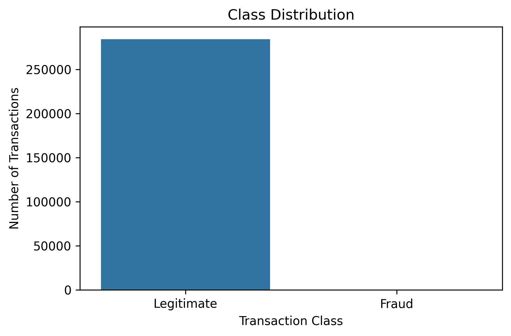
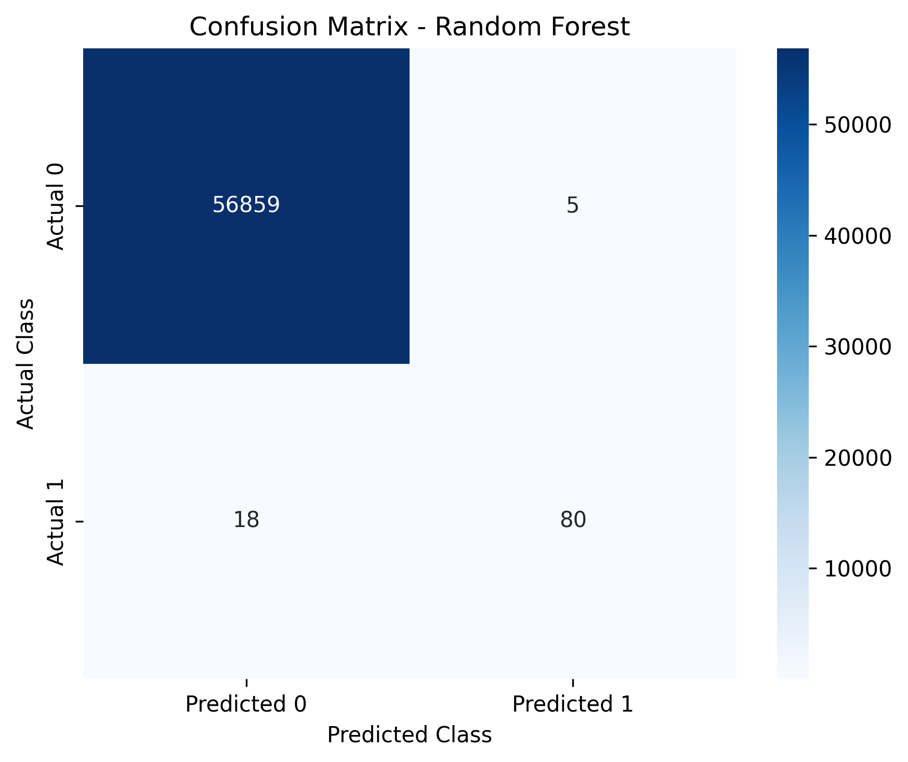
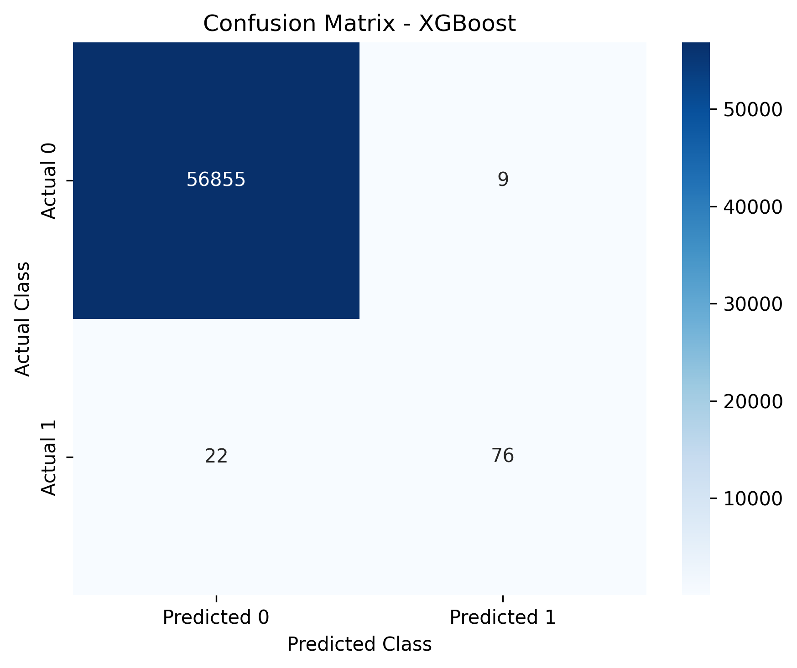

# Imbalanced Transaction Fraud Detection with Ensemble Learning

Machine learning pipeline for detecting fraudulent credit card transactions in a highly imbalanced dataset.

The project implements a modular fraud-detection workflow built around **Logistic Regression, Random Forest and XGBoost**, with dedicated preprocessing, model construction and evaluation modules.

The main focus is not only classification accuracy, but the behavior of different models under **severe class imbalance**, where fraudulent transactions represent only a very small fraction of all observations.

---

## Overview

Fraud detection is a highly imbalanced binary classification problem.

In this dataset:

- **284,807** transactions are available
- **492** transactions are fraudulent
- fraud represents approximately **0.173%** of the dataset

Because legitimate transactions dominate the dataset, accuracy alone is not an appropriate performance metric.

The models are therefore evaluated primarily using:

- Precision
- Recall
- F1-score
- Confusion matrices

The evaluation module also supports probability-based metrics such as **ROC-AUC** and **PR-AUC**.

---
## Dataset

The dataset used in this project is the **Credit Card Fraud Detection** dataset published on Kaggle by the Machine Learning Group (ULB).

It contains 284,807 credit card transactions, including 492 fraudulent transactions, resulting in a highly imbalanced binary classification problem.

Dataset source: [Kaggle - Credit Card Fraud Detection](https://www.kaggle.com/datasets/mlg-ulb/creditcardfraud)

## Machine Learning Pipeline

```text
Raw Transaction Data
        │
        ▼
Data Loading
        │
        ▼
Feature / Target Separation
        │
        ▼
Stratified Train-Test Split
        │
        ├──────────────────────────────┐
        │                              │
        ▼                              ▼
StandardScaler                   Original Features
        │                              │
        ▼                              │
      SMOTE                            │
        │                              │
        ▼                              ▼
Logistic Regression             Random Forest
                                       │
                                       ▼
                                    XGBoost
        │                              │
        └──────────────┬───────────────┘
                       ▼
                  Model Evaluation
                       │
                       ▼
        Precision / Recall / F1-score
                       │
                       ▼
             Confusion Matrices
                       │
                       ▼
              Model Comparison
```

---

## Models

### Logistic Regression

Logistic Regression is trained using standardized features and a SMOTE-resampled training set.

```text
Training Data
    ↓
StandardScaler
    ↓
SMOTE
    ↓
Logistic Regression
```

SMOTE is applied **only to the training set**. The test set remains untouched so that evaluation is performed on the original data distribution.

---

### Random Forest

Random Forest is trained directly on the original training features.

```text
Training Data
    ↓
Random Forest
```

Feature scaling is not required because Random Forest is based on decision trees.

The current configuration uses:

```python
RandomForestClassifier(
    n_estimators=100,
    random_state=42,
    n_jobs=-1
)
```

---

### XGBoost

XGBoost is also trained on the original training data without feature scaling.

The current configuration uses:

```python
XGBClassifier(
    n_estimators=100,
    max_depth=4,
    learning_rate=0.1,
    eval_metric="logloss",
    random_state=42
)
```

---

## Results

| Model | Accuracy | Precision | Recall | F1-score |
|---|---:|---:|---:|---:|
| Logistic Regression | 97.41% | 5.78% | **91.84%** | 10.88% |
| Random Forest | **99.96%** | **94.12%** | 81.63% | **87.43%** |
| XGBoost | 99.95% | 89.41% | 77.55% | 83.06% |

### Interpretation

Logistic Regression achieves the highest recall and therefore detects most fraudulent transactions. However, its precision is very low, which means that it also produces a large number of false positive fraud alerts.

Random Forest achieves a substantially stronger balance between precision and recall and currently produces the highest F1-score.

XGBoost also achieves high precision and a strong F1-score, although its recall is lower than that of Random Forest.

The results demonstrate why **accuracy alone is misleading for highly imbalanced fraud-detection problems**.

---

## Model Comparison



---

## Class Distribution

The dataset contains an extreme imbalance between legitimate and fraudulent transactions.



---

## Confusion Matrices

### Logistic Regression


### Random Forest



### XGBoost



---

## Project Structure

```text
imbalanced-transaction-fraud-detection-with-ensemble-learning/
│
├── data/
│   ├── raw/
│   │   └── creditcard.csv
│   └── processed/
│
├── models/
│   └── *.joblib
│
├── notebooks/
│   └── fraud_detection_analysis.ipynb
│
├── results/
│   ├── figures/
│   │   ├── amount_by_class.png
│   │   ├── class_distribution.png
│   │   ├── logistic_regression_confusion_matrix.png
│   │   ├── random_forest_confusion_matrix.png
│   │   ├── xgboost_confusion_matrix.png
│   │   └── model_comparison.png
│   │
│   └── metrics/
│       └── model_metrics.csv
│
├── src/
│   ├── __init__.py
│   ├── preprocessing.py
│   ├── modeling.py
│   └── evaluation.py
│
├── .gitignore
├── README.md
└── requirements.txt
```

---

## Source Code Architecture

The project separates reusable machine-learning logic from exploratory notebook code.

### `src/preprocessing.py`

Responsible for:

```text
load_data()
split_features_target()
split_dataset()
scale_features()
apply_smote()
```

This module handles dataset loading, stratified splitting, feature standardization and minority-class oversampling.

### `src/modeling.py`

Responsible for:

```text
create_logistic_regression()
create_random_forest()
create_xgboost()
save_model()
```

Model construction is kept outside the notebook so that configuration can be reused and modified independently from the analysis workflow.

### `src/evaluation.py`

Responsible for:

```text
calculate_metrics()
calculate_probability_metrics()
plot_confusion_matrix()
create_metrics_table()
plot_model_comparison()
```

This module centralizes model evaluation and visualization.

---

# Running the Project

## 1. Clone the Repository

```bash
git clone https://github.com/lanadanolic/imbalanced-transaction-fraud-detection-with-ensemble-learning.git
```

Enter the project directory:

```bash
cd imbalanced-transaction-fraud-detection-with-ensemble-learning
```

---

## 2. Create a Virtual Environment

Creating an isolated Python environment is recommended.

### Windows

```bash
python -m venv .venv
```

Activate it:

```bash
.venv\Scripts\activate
```

### macOS / Linux

```bash
python3 -m venv .venv
```

Activate it:

```bash
source .venv/bin/activate
```

---

## 3. Install Dependencies

Upgrade `pip`:

```bash
python -m pip install --upgrade pip
```

Install the project dependencies:

```bash
python -m pip install -r requirements.txt
```

The project currently depends on:

```text
pandas
numpy
matplotlib
seaborn
scikit-learn
imbalanced-learn
xgboost
jupyter
joblib
```

---

## 4. Add the Dataset

Download the dataset from [Kaggle - Credit Card Fraud Detection](https://www.kaggle.com/datasets/mlg-ulb/creditcardfraud) and place `creditcard.csv` inside:

Place the dataset inside:

```text
data/raw/creditcard.csv
```

The expected project layout is:

```text
data/
└── raw/
    └── creditcard.csv
```

The notebook will automatically resolve the dataset using the project root directory.

---

## 5. Start Jupyter

From the repository root, run:

```bash
jupyter notebook
```

Then open:

```text
notebooks/fraud_detection_analysis.ipynb
```

Alternatively, the notebook can be opened directly in VS Code using the Jupyter extension.

---

## 6. Run the Analysis

Run all cells from the beginning.

The notebook performs the following workflow:

```text
1. Import project modules
2. Load the transaction dataset
3. Inspect dataset structure
4. Analyze class imbalance
5. Separate features and target
6. Create stratified train/test split
7. Standardize features
8. Apply SMOTE to the Logistic Regression training data
9. Train Logistic Regression
10. Train Random Forest
11. Train XGBoost
12. Generate predictions
13. Calculate evaluation metrics
14. Generate confusion matrices
15. Compare model performance
16. Save metrics and figures
17. Serialize trained models
```

---

## Generated Outputs

After the notebook completes successfully, generated visualizations are written to:

```text
results/figures/
```

Model metrics are written to:

```text
results/metrics/model_metrics.csv
```

Locally serialized models are written to:

```text
models/
```

For example:

```text
models/
├── logistic_regression.joblib
├── random_forest.joblib
└── xgboost.joblib
```

The serialized model files are excluded from Git through `.gitignore`.

---

## Reproducibility

A fixed random seed is used throughout the project:

```python
SEED = 42
```

The same seed is used for:

- train/test splitting
- SMOTE
- Logistic Regression
- Random Forest
- XGBoost

The train/test split is stratified to preserve the original fraud ratio:

```python
train_test_split(
    X,
    y,
    test_size=0.20,
    stratify=y,
    random_state=42
)
```

---

## Important Design Decisions

### No resampling of the test set

SMOTE is applied only to the training data.

The test set retains the original highly imbalanced class distribution.

This prevents synthetic observations from contaminating final model evaluation.

### Scaling is learned only from training data

```python
scaler.fit_transform(X_train)
scaler.transform(X_test)
```

The scaler is never fitted on test data, avoiding data leakage.

### Different preprocessing for different algorithms

Logistic Regression uses standardized and SMOTE-balanced data.

Random Forest and XGBoost are trained on the original feature representation because tree-based models do not require standardization.

---

## Evaluation Strategy

For highly imbalanced classification tasks, accuracy can be misleading.

A classifier could predict nearly every transaction as legitimate and still obtain very high accuracy.

For this reason, model comparison focuses on:

```text
Precision
Recall
F1-score
```

where:

- **Precision** measures how many transactions predicted as fraud are actually fraudulent.
- **Recall** measures how many real fraudulent transactions are detected.
- **F1-score** balances precision and recall.

The evaluation utilities additionally support:

```text
ROC-AUC
PR-AUC
```

for probability-based model evaluation.

---

## Technologies

```text
Python
pandas
NumPy
scikit-learn
imbalanced-learn
XGBoost
Matplotlib
Seaborn
Jupyter
joblib
Git
GitHub
```

---

## Repository

```text
https://github.com/lanadanolic/imbalanced-transaction-fraud-detection-with-ensemble-learning
```